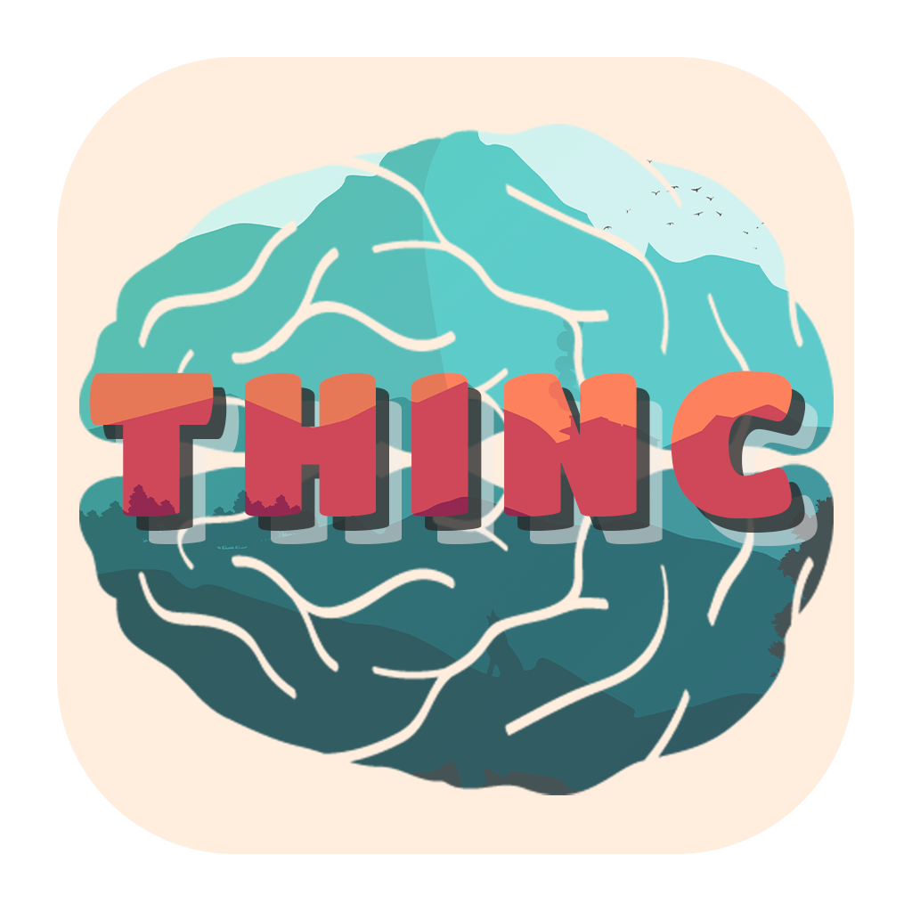

<!-- PROJECT LOGO -->
<br />
<p align="center">
  <a href="https://github.com/rskrfn/ThincMobile">
    
  </a>

  <h2 align="center">Thinc</h2>

  <p align="center">
    This project is the Mobile version from our assignment of building online based class implementing React Native.
    <br />
    (Under Development)
  </p>
</p>

<!-- TABLE OF CONTENTS -->
<details open="open">
  <summary><h2 style="display: inline-block">Contents</h2></summary>
  <ol>
    <li>
      <a href="#about-the-project">About The Project</a>
      <ul>
        <li><a href="#built-with">Built With</a></li>
      </ul>
    </li>
    <li>
      <a href="#getting-started">Getting Started</a>
      <ul>
        <li><a href="#prerequisites">Prerequisites</a></li>
        <li><a href="#installation">Installation</a></li>
      </ul>
    </li>
    <li><a href="#usage">Usage</a></li>
    <li><a href="#roadmap">Roadmap</a></li>
    <li><a href="#contact">Contact</a></li>

  </ol>
</details>

<!-- ABOUT THE PROJECT -->

## About The Project

This project is the Mobile version from our assignment of building online based class implementing React Native.
Assigned by Arkademy to Fullstack Mobile 21 Class.
This project is a step for us to become a fullstack mobile developer.

### Built With

- [React Native](https://reactnative.dev/)
- [Axios](https://www.npmjs.com/package/axios)
- [Javascript](https://www.w3schools.com/js/DEFAULT.asp)

<!-- GETTING STARTED -->

## Getting Started

To get a local copy up and running follow these simple steps.

### Prerequisites

Things you need to install

- react native
  ```sh
  npx react-native init (YourAppName)
  ```

### Installation

1. Clone the repo
   ```sh
   git clone https://github.com/rskrfn/ThincMobile.git
   ```
      <!-- ROADMAP -->
## Roadmap

This project is our learning step to become a fullstack mobile developer.
Should be adding more features and continuous improvement on a weekly basis until this project is completed.

<!-- CONTACT -->

## Contact

Riski Arifani - [arifaniriski@gmail.com](https://mail.google.com/mail/u/0/?fs=0&to=arifaniriski@gmail.com&su=react.js+implementation&tf=cm)

Project Link: [https://github.com/rskrfn/ThincMobile](https://github.com/rskrfn/ThincMobile)
